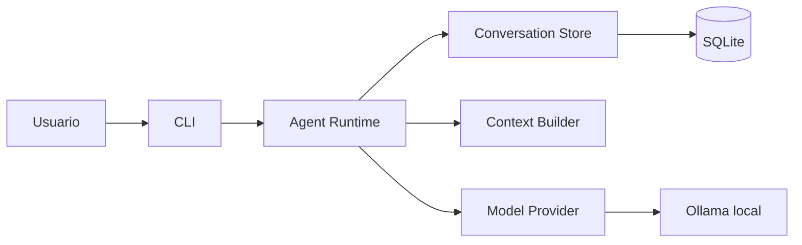
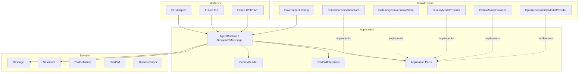
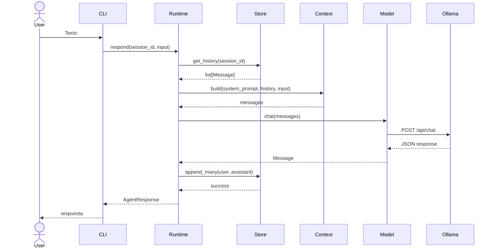

# Architecture

## 1. Propósito del documento

Este documento define la arquitectura del proyecto **AI Assistant**, un asistente de IA local-first, modular, extensible y desacoplado.

La arquitectura está diseñada para mantener independientes:

- El runtime del agente.
- Los proveedores de modelos.
- La memoria conversacional.
- Las interfaces de usuario.
- La persistencia.
- Las futuras herramientas.
- Los futuros servicios de alto rendimiento escritos en C.

El documento distingue explícitamente entre:

- **Implemented**: ya existe en el repositorio.
- **Planned in Phase 1**: debe completarse durante la fase actual.
- **Future**: pertenece a fases posteriores y no debe condicionar innecesariamente el diseño actual.

---

## 2. Estado actual

### 2.1 Fase actual

**Phase 1: Python Core**

Phase 1 está implementada y lista para revisión final. El núcleo funcional en Python incluye:

- Gateway delgado.
- Runtime de agente framework-agnostic.
- Abstracción de mensajes.
- Constructor de contexto.
- Adaptadores de modelo.
- Modelo dummy.
- Adaptador OpenAI-compatible.
- Adaptador Ollama nativo.
- Memoria en memoria.
- Persistencia SQLite.
- CLI mínima.
- Sesión predeterminada persistente.
- Logging básico.
- Configuración mediante variables de entorno.
- Pruebas con `pytest`.

### 2.2 Fuera de alcance en Phase 1

No forman parte de esta fase:

- UI web.
- TUI avanzada.
- Integraciones con Telegram u otras plataformas.
- Ejecución real de herramientas.
- Embeddings.
- RAG.
- Memoria semántica.
- Multiagente.
- Streaming.
- Servidor C productivo de herramientas.
- Plugins dinámicos.
- Sincronización entre dispositivos.

---

## 3. Restricciones y supuestos

### 3.1 Plataforma

- Sistema operativo principal: Arch Linux.
- Python: 3.12 o superior.
- Ollama: proceso local.
- Transporte: HTTP local.
- Base URL predeterminada: `http://localhost:11434`.
- Persistencia inicial: SQLite.

### 3.2 Hardware de referencia

- VRAM: 6 GB.
- RAM: 64 GB.

Este hardware permite ejecutar modelos locales pequeños e intermedios, pero obliga a controlar:

- Tamaño del modelo.
- Cuantización.
- Ventana de contexto.
- Consumo de KV cache.
- Latencia.
- Descarga parcial de capas a RAM.

### 3.3 Perfiles de modelo

| Perfil | Modelo recomendado | Uso |
|---|---|---|
| development | Gemma 4 E2B Q4 | Desarrollo diario, smoke tests y validación rápida |
| validation | Gemma 4 E4B Q4 | Evaluación funcional y comportamiento |
| evaluation | Gemma 4 12B Q4 | Evaluación manual de calidad con descarga parcial a RAM |

El modelo exacto nunca debe estar codificado dentro del runtime.

Debe configurarse mediante:

```text
AI_ASSISTANT_MODEL
```

La guía operativa de perfiles vive en `docs/model-profiles.md`.

---

## 4. Principios arquitectónicos

### 4.1 Dependency Inversion

El runtime depende de abstracciones internas, no de implementaciones externas.

Ejemplo:

```text
AgentRuntime
    |
    v
ModelProvider
    ^
    |
OllamaModelProvider
OpenAICompatibleModelProvider
DummyModelProvider
```

### 4.2 Ports & Adapters

Los componentes externos se integran mediante adaptadores.

Adaptadores primarios:

- CLI.
- Futuras TUI.
- Futuras API HTTP.
- Futuros WebSockets.

Adaptadores secundarios:

- Ollama.
- OpenAI-compatible.
- SQLite.
- Memoria en memoria.
- Futuros ejecutores de herramientas.

### 4.3 Clean Architecture

La dirección de dependencias siempre apunta hacia el núcleo:

```text
interfaces -> application -> domain
infrastructure -> application ports
infrastructure -> domain
```

Nunca:

```text
domain -> sqlite
application -> ollama
application -> cli
```

### 4.4 Single Responsibility

Cada componente tiene una responsabilidad principal:

- Runtime: orquestar.
- ContextBuilder: construir contexto.
- ModelProvider: responder mediante un modelo.
- ConversationStore: persistir historial.
- CLI: recibir y mostrar datos.
- ToolCallInterpreter: interpretar tool calls.
- Bootstrap: ensamblar dependencias.

### 4.5 Framework Agnostic

El núcleo no depende de:

- LangChain.
- LangGraph.
- Semantic Kernel.
- SDK oficial de OpenAI.
- SDK oficial de Ollama.

La adopción futura de cualquiera de estas herramientas deberá realizarse mediante adaptadores.

### 4.6 Local-first

El sistema debe funcionar con:

- Modelo local.
- Persistencia local.
- Configuración local.
- CLI local.
- Sin servicios externos obligatorios.

---

## 5. Vista de contexto



---

## 6. Arquitectura de alto nivel



---

## 7. Capas

## 7.1 Domain

Contiene conceptos independientes de proveedores y persistencia.

### Responsabilidades

- Representar mensajes.
- Representar sesiones.
- Representar definiciones declarativas de herramientas.
- Representar tool calls tipados.
- Mantener invariantes.
- Definir errores del dominio.

### Dependencias permitidas

- Biblioteca estándar de Python.
- Otros módulos del dominio.

### Dependencias prohibidas

- SQLite.
- HTTP.
- Variables de entorno.
- CLI.
- Ollama.
- OpenAI.
- Logging de infraestructura.

---

## 7.2 Application

Contiene casos de uso y puertos.

### Responsabilidades

- Orquestar una petición.
- Leer historial.
- Construir contexto.
- Invocar el modelo.
- Interpretar tool calls.
- Persistir turnos completos.
- Devolver respuestas normalizadas.

### Dependencias permitidas

- Domain.
- Puertos definidos dentro de Application.

### Dependencias prohibidas

- Adaptadores concretos.
- SQLite.
- Ollama.
- `os.environ`.
- Impresión directa a consola.

---

## 7.3 Infrastructure

Implementa puertos.

### Responsabilidades

- Persistencia SQLite.
- Persistencia en memoria.
- Transporte HTTP.
- Adaptador Ollama nativo.
- Adaptador OpenAI-compatible.
- Configuración mediante variables de entorno.
- Logging técnico.

### Dependencias permitidas

- Domain.
- Puertos de Application.
- Biblioteca estándar.
- Dependencias externas mínimas y justificadas.

---

## 7.4 Interfaces

Contiene adaptadores de entrada.

### Responsabilidades

- Capturar entrada.
- Invocar casos de uso.
- Mostrar salida.
- Traducir errores internos a mensajes legibles.
- Manejar EOF, `exit`, `quit` y `Ctrl+C`.

### Dependencias permitidas

- Application.
- Domain.

### Dependencias prohibidas

- SQL directo.
- Construcción manual de requests de Ollama.
- Lectura directa del historial.
- Detección de tool calls.

---

## 7.5 Bootstrap

Es el composition root.

### Responsabilidades

- Cargar configuración.
- Construir adaptadores.
- Resolver proveedor.
- Construir runtime.
- Inyectar dependencias.
- Crear la aplicación CLI.

Bootstrap es el único módulo autorizado para conocer simultáneamente:

- Interfaces.
- Application.
- Domain.
- Infrastructure.

---

## 8. Módulos principales

## 8.1 `Message`

Dataclass inmutable.

Campos actuales o esperados:

```text
role
content
session_id optional
tool_name optional
tool_call_id optional
```

Responsabilidades:

- Validar contenido no vacío.
- Representar mensajes internos.
- Evitar formatos específicos de proveedores.

No debe:

- Serializar directamente requests de Ollama.
- Ejecutar herramientas.
- Consultar SQLite.

---

## 8.2 `SessionId`

Representa una sesión conversacional.

En Phase 1:

```text
type: string
default: "default"
persistent across executions: yes
interactive management: no
```

El sistema debe aceptar una sesión predeterminada configurable mediante:

```text
AI_ASSISTANT_SESSION
```

---

## 8.3 `ContextBuilder`

Orden de contexto:

1. Prompt de sistema.
2. Historial seleccionado.
3. Input actual.

Responsabilidades:

- Validar input.
- Construir la secuencia final.
- Aplicar una política simple de presupuesto de contexto.

Política inicial:

```text
1. Conservar system prompt.
2. Conservar mensaje actual.
3. Recorrer historial desde el más reciente.
4. Detenerse al alcanzar el límite configurado.
```

No debe:

- Consultar SQLite.
- Ejecutar resúmenes.
- Calcular embeddings.
- Depender de un proveedor.

---

## 8.4 `AgentRuntime`

Caso de uso principal.

Firma conceptual:

```text
respond(session_id, user_input) -> AgentResponse
```

Responsabilidades:

1. Validar solicitud.
2. Obtener historial.
3. Construir contexto.
4. Invocar modelo.
5. Interpretar respuesta.
6. Persistir turno.
7. Devolver resultado.

No debe:

- Construir SQL.
- Leer variables de entorno.
- Imprimir.
- Ejecutar herramientas.
- Interpretar JSON específico de Ollama.

---

## 8.5 `ModelProvider`

Puerto interno.

Contrato mínimo de Phase 1:

```text
chat(messages) -> Message
```

Implementaciones:

- `DummyModelProvider`.
- `OllamaModelProvider`.
- `OpenAICompatibleModelProvider`.

Extensiones futuras:

- Streaming.
- Structured output.
- Tool calling nativo.
- Multimodalidad.
- Métricas de uso.

Estas extensiones no deben incorporarse al contrato actual hasta que exista una necesidad concreta.

---

## 8.6 `ConversationStore`

Puerto interno.

Contrato recomendado:

```text
get_history(session_id) -> list[Message]
append(session_id, message) -> None
append_many(session_id, messages) -> None
clear(session_id) -> None
```

`append_many` debe ser transaccional.

---

## 8.7 `ToolDefinition`

Estructura declarativa:

```text
name
description
input_schema
```

Phase 1 no ejecuta herramientas.

---

## 8.8 `ToolCallInterpreter`

Responsabilidades:

- Detectar estructura explícita.
- Traducirla a `ToolCall`.
- Devolver un resultado tipado.
- No ejecutar.

---

## 8.9 `OllamaModelProvider`

Usa la API nativa de Ollama.

Endpoint principal:

```text
POST /api/chat
```

Request mínimo:

```json
{
  "model": "<configurable>",
  "messages": [],
  "stream": false
}
```

Responsabilidades:

- Traducir `Message` a formato Ollama.
- Realizar HTTP.
- Validar status.
- Parsear JSON.
- Traducir respuesta a `Message`.
- Normalizar errores.

No debe:

- Leer historial.
- Persistir.
- Imprimir.
- Decidir session ID.

---

## 8.10 `OpenAICompatibleModelProvider`

Debe permanecer separado del adaptador Ollama.

Ambos implementan el mismo puerto, pero usan contratos externos diferentes.

---

## 8.11 `ModelProviderFactory`

Responsabilidad:

- Seleccionar proveedor según configuración.

Valores esperados:

```text
dummy
ollama
openai-compatible
```

No debe imprimir el proveedor.

Debe generar un error de configuración ante valores desconocidos.

---

## 9. Estructura recomendada del repositorio

```text
ai_assistant/
├── domain/
│   ├── __init__.py
│   ├── message.py
│   ├── session.py
│   ├── tools.py
│   └── errors.py
│
├── application/
│   ├── __init__.py
│   ├── runtime.py
│   ├── context.py
│   ├── tool_calls.py
│   └── ports/
│       ├── __init__.py
│       ├── models.py
│       ├── memory.py
│       └── tools.py
│
├── infrastructure/
│   ├── __init__.py
│   ├── models/
│   │   ├── dummy.py
│   │   ├── ollama.py
│   │   ├── openai_compatible.py
│   │   └── factory.py
│   ├── persistence/
│   │   ├── in_memory_conversation.py
│   │   └── sqlite_conversation.py
│   ├── http/
│   │   └── urllib_transport.py
│   └── config/
│       ├── settings.py
│       └── environment.py
│
├── interfaces/
│   ├── __init__.py
│   └── cli/
│       └── app.py
│
├── bootstrap/
│   ├── __init__.py
│   └── container.py
│
├── tests/
│   ├── unit/
│   ├── integration/
│   ├── contract/
│   ├── smoke/
│   └── fakes/
│
├── docs/
│   ├── architecture.md
│   └── adr/
│
├── main.py
├── pyproject.toml
├── pytest.ini
├── .gitignore
└── README.md
```

---

## 10. Dependencias permitidas

La estructura por capas ya existe en el repositorio:

- `ai_assistant/domain/`: mensajes, sesiones, errores y modelos declarativos de herramientas.
- `ai_assistant/application/`: runtime, context builder, tool-call interpreter y puertos.
- `ai_assistant/infrastructure/`: adaptadores de modelo y stores de memoria.
- `ai_assistant/interfaces/`: CLI como adaptador primario.
- `ai_assistant/bootstrap/`: composition root.

Los paquetes `ai_assistant/agent/`, `ai_assistant/cli/` y
`ai_assistant/storage/` permanecen como fachadas de compatibilidad durante
Phase 1.

| Origen | Domain | Application | Infrastructure | Interfaces |
|---|---:|---:|---:|---:|
| Domain | Sí | No | No | No |
| Application | Sí | Sí | No | No |
| Infrastructure | Sí | Solo puertos | Sí | No |
| Interfaces | Sí | Sí | No idealmente | Sí |
| Bootstrap | Sí | Sí | Sí | Sí |

---

## 11. Flujo completo de una petición



---

## 12. Persistencia

### 12.1 Esquema mínimo

```sql
CREATE TABLE messages (
    id INTEGER PRIMARY KEY AUTOINCREMENT,
    session_id TEXT NOT NULL,
    role TEXT NOT NULL,
    content TEXT NOT NULL,
    tool_name TEXT,
    tool_call_id TEXT,
    created_at TEXT NOT NULL
);
```

Índice:

```sql
CREATE INDEX idx_messages_session_id_id
ON messages(session_id, id);
```

### 12.2 Reglas

- El historial se filtra por `session_id`.
- El orden definitivo se basa en `id`.
- El turno usuario-asistente se persiste en una transacción.
- Si el modelo falla, no se persiste un turno incompleto.
- La base local no se incluye en Git.

---

## 13. Configuración

Fuente principal:

```text
Variables de entorno
```

Variables:

```text
AI_ASSISTANT_PROVIDER=ollama
AI_ASSISTANT_MODEL=<installed-ollama-tag>
AI_ASSISTANT_BASE_URL=http://localhost:11434
AI_ASSISTANT_DATABASE=assistant.sqlite3
AI_ASSISTANT_SESSION=default
AI_ASSISTANT_SYSTEM_PROMPT=...
AI_ASSISTANT_LOG_LEVEL=INFO
AI_ASSISTANT_REQUEST_TIMEOUT=120
AI_ASSISTANT_CONTEXT_LIMIT=4096
```

Precedencia futura:

```text
CLI args > environment > defaults
```

Phase 1 no requiere `.env`, TOML ni frameworks de configuración.

---

## 14. Logging

Biblioteca:

```text
logging
```

Salida:

```text
stderr
```

Nivel predeterminado:

```text
INFO
```

Campos recomendados:

- Provider.
- Model.
- Session ID.
- Duración.
- Estado.
- Cantidad de mensajes.
- Tipo de error.

No registrar por defecto:

- API keys.
- Prompts completos.
- Respuestas completas.
- Variables de entorno completas.
- Cuerpos HTTP completos.

---

## 15. Manejo de errores

Errores internos recomendados:

```text
ConfigurationError
ModelConnectionError
ModelNotFoundError
ModelTimeoutError
ModelProtocolError
ConversationStoreError
InvalidMessageError
InvalidSessionError
InvalidToolCallError
```

Mapeo:

```text
Ollama no disponible -> ModelConnectionError
Modelo ausente -> ModelNotFoundError
Timeout -> ModelTimeoutError
JSON inválido -> ModelProtocolError
Respuesta sin mensaje -> ModelProtocolError
SQLite error -> ConversationStoreError
```

La CLI traduce estos errores a mensajes legibles.

---

## 16. Estrategia de pruebas

Framework:

```text
pytest
```

Marcadores:

```text
unit
integration
contract
ollama
smoke
```

### Unitarias

- Runtime.
- ContextBuilder.
- Sesiones.
- Factoría.
- Mapeo de mensajes.
- Manejo de errores.

### Integración

- SQLite temporal.
- Persistencia por sesión.
- Transacciones.
- Reapertura.

### Contrato

#### Ollama nativo

- Request `/api/chat`.
- `stream=false`.
- Respuesta válida.
- Error HTTP.
- Timeout.
- JSON inválido.
- Modelo no instalado.

#### OpenAI-compatible

- Request compatible.
- Response compatible.
- Errores.
- Timeout.

### Smoke

- CLI con Dummy.
- CLI con Ollama.

### CI

Jobs recomendados:

```text
unit
integration
contract
ollama-smoke
```

Ollama real debe ejecutarse en un job separado.

---

## 17. Seguridad local-first

Phase 1 debe garantizar:

- No registrar secretos.
- No enviar datos a proveedores externos por defecto.
- No ejecutar herramientas.
- No ejecutar shell.
- No abrir puertos de red.
- No almacenar credenciales en SQLite.
- No incluir la base local en Git.

Futuras herramientas deberán incorporar:

- Lista de permisos.
- Confirmación.
- Sandbox.
- Timeouts.
- Límites de recursos.
- Auditoría.
- Separación por proceso.

---

## 18. Puntos de extensión

### Modelos

```text
ModelProvider
```

### Memoria conversacional

```text
ConversationStore
```

### Memoria semántica futura

```text
MemoryRetriever
MemoryWriter
```

### Herramientas futuras

```text
ToolCatalog
ToolCallInterpreter
ToolPolicy
ToolExecutor
```

## 18.1 Phase 2 Proposed Tool Policy

Phase 2 is limited to read-only workspace inspection through exactly two productive tools:

- `list_directory`
- `read_file`

The model may request a tool, but authorization is deterministic application policy. Productive execution remains blocked until ADR-016 through ADR-025 are accepted.

Required invariants:

- deny by default;
- no shell, process execution, Git execution, network access or writes;
- all paths are relative to `AI_ASSISTANT_WORKSPACE`;
- external absolute paths, traversal, external symlinks, hidden paths, sensitive paths and special files are denied;
- default and hard limits are enforced for timeout, bytes, directory entries, recursion depth, path length, request payload and response payload;
- every allow, deny, success, timeout and failure outcome is audited with sanitized metadata;
- prompts, model responses and file contents are not stored in audit or logs;
- `read_file` decodes bounded bytes as UTF-8 with replacement for invalid binary sequences;
- the runtime may perform at most one tool execution round per user turn.

The proposed ADR package is:

- ADR-016 Safe Tool Execution Pipeline
- ADR-017 Deny-by-Default Tool Policy
- ADR-018 Read-Only Tool Allowlist
- ADR-019 Workspace Confinement and Path Resolution
- ADR-020 Tool Execution Audit and Retention
- ADR-021 Tool Timeouts and Resource Limits
- ADR-022 Unix Socket Tool Executor
- ADR-023 Error and Log Redaction
- ADR-024 Bounded Single Tool Round per Turn
- ADR-025 Sensitive File Deny Policy

### Interfaces

```text
CLI
TUI
HTTP API
WebSocket
Desktop
```

### Transporte

```text
UrllibHttpTransport
Future HttpxTransport
Future UnixSocketTransport
```

---

## 19. Decisiones inmediatas

Deben completarse en Phase 1:

1. Separar capas.
2. Formalizar puertos.
3. Introducir sesiones.
4. Crear composition root.
5. Centralizar configuración.
6. Implementar Ollama nativo.
7. Migrar a pytest.
8. Normalizar errores.
9. Añadir logging.
10. Definir herramientas declarativas sin ejecución.

---

## 20. Decisiones pospuestas

- Streaming.
- Multiagente.
- RAG.
- Embeddings.
- Memoria semántica.
- Ejecución de herramientas.
- Servidor C.
- Plugins dinámicos.
- UI web.
- TUI avanzada.
- Sincronización.
- Cifrado.
- Scheduler.
- Background jobs.

---

## 21. ADR recomendados

```text
ADR-001 Ports and Adapters
ADR-002 Python Core
ADR-003 Internal Message Model
ADR-004 SQLite Persistence
ADR-005 Explicit Sessions
ADR-006 ModelProvider Port
ADR-007 Configuration at Bootstrap
ADR-008 Declarative Tools Only
ADR-009 No Agent Framework
ADR-010 Transactional Turn Persistence
ADR-011 Native Ollama Adapter
ADR-012 Minimal External Dependencies
ADR-013 Pytest Testing Strategy
ADR-014 Non-streaming Phase 1
ADR-015 Model Profiles for Limited Hardware
```
